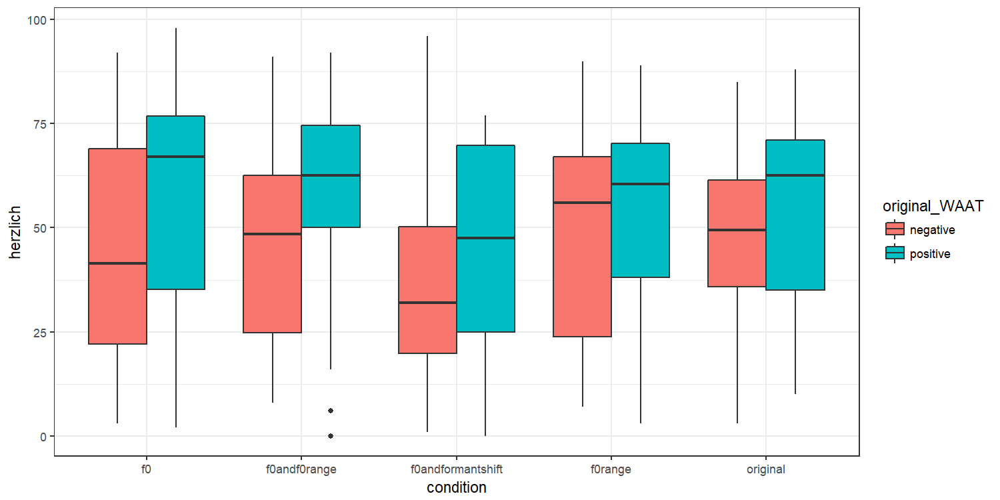

Effects of speech manipulations on warmth (ANOVA)
================
Laura Fernández Gallardo
April 2018

-   [Objectives](#objectives)
-   [3-way repeated measures ANOVA](#way-repeated-measures-anova)
-   [Boxplots across conditions](#boxplots-across-conditions)

``` r
# Libraries needed:

library(ggplot2) # for plots
library(ez) # for ezANOVA
```

Objectives
----------

To assess the effects of manipulated speech (pitch, pitch range and formant shifts) on speakers' attributed warmth.

Load all stimuli dataframe and listeners' answers from test.

Load output generated by GUI (listeners' answers)

``` r
path_testoutput <- "../listening_test/GUI/files/output" 

answers <- data.frame()
file.names <- dir(path_testoutput, pattern =".csv") 
for(i in 1:length(file.names)){
  dataread <- read.csv(paste0(path_testoutput,'/',file.names[i]), header=TRUE, sep=",") 
  answers <- rbind(answers,dataread)
}
```

Merge answers and all\_stimuli (information of conditions)

``` r
mydata <- merge(all_stimuli, answers)
summary(mydata)
```

    ##                                                                   filename  
    ##  m041_bucharest_d2_2b_04_cut.wav                                      :  7  
    ##  m041_bucharest_d2_2b_04_cut_Pitch40Hz_Up-FactorRange_0_4_Down-new.wav:  7  
    ##  m041_bucharest_d2_2b_04_cut_Pitch40Hz_Up-new.wav                     :  7  
    ##  m041_bucharest_d2_2b_04_cut_Range_Factor_0.4_Down.wav                :  7  
    ##  m041_bucharest_d2_2b_04_cut_shift11f40.wav                           :  7  
    ##  m090_riyadh_d2_2b_04.wav                                             :  7  
    ##  (Other)                                                              :238  
    ##              condition  speaker_gender   speaker_ID      original_WAAT
    ##  f0               :56   m:140          Min.   : 41.00   negative:140  
    ##  f0andf0range     :56   w:140          1st Qu.: 95.25   positive:140  
    ##  f0andformantshift:56                  Median :131.50                 
    ##  f0range          :56                  Mean   :163.50                 
    ##  original         :56                  3rd Qu.:259.25                 
    ##                                        Max.   :294.00                 
    ##                                                                       
    ##   nameListener  ageListener genderListener languageListener    herzlich   
    ##  Min.   :1     Min.   :23   w: 80          Polish  :40      Min.   : 0.0  
    ##  1st Qu.:2     1st Qu.:25   m:200          German  :40      1st Qu.:28.0  
    ##  Median :4     Median :27                  Spanish :40      Median :53.0  
    ##  Mean   :4     Mean   :27                  Nepalese:40      Mean   :49.2  
    ##  3rd Qu.:6     3rd Qu.:29                  Croatian:40      3rd Qu.:69.0  
    ##  Max.   :7     Max.   :30                  Dutch   :40      Max.   :98.0  
    ##                                            Bangla  :40

``` r
## listeners
#mean(mydata$ageListener)
#sd(mydata$ageListener)
#
#unique(mydata$languageListener)
```

3-way repeated measures ANOVA
-----------------------------

3-way repeated measures ANOVA to test the effects of

-   speech manipulation condition
-   speaker gender
-   speaker "true" warmth (original\_WAAT)
-   interactions

3-way -&gt; because we test the effect of 3 independent variable (with 2 or more levels each)

repeated measures -&gt; because the same test participants rate the same dependent variable (speakers' warmth) for different conditions (speech manipulations)

We use the package ez to compute ezANOVA: Bakeman, R. (2005). Recommended effect size statistics for repeated measures designs. Behavior Research Methods, 37 (3), 379-384.

``` r
ezANOVA(data=mydata,
        dv='herzlich',
        wid=nameListener,
        within=.(condition, original_WAAT, speaker_gender),
        type = 2)
```

    ## Warning: Converting "nameListener" to factor for ANOVA.

    ## Warning: Collapsing data to cell means. *IF* the requested effects are a
    ## subset of the full design, you must use the "within_full" argument, else
    ## results may be inaccurate.

    ## $ANOVA
    ##                                   Effect DFn DFd         F           p
    ## 2                              condition   4  24 4.4792206 0.007608083
    ## 3                          original_WAAT   1   6 1.5674181 0.257175214
    ## 4                         speaker_gender   1   6 1.3971429 0.281920067
    ## 5                condition:original_WAAT   4  24 0.3205430 0.861396872
    ## 6               condition:speaker_gender   4  24 1.3431061 0.282951881
    ## 7           original_WAAT:speaker_gender   1   6 4.8512572 0.069855702
    ## 8 condition:original_WAAT:speaker_gender   4  24 0.6805409 0.612214303
    ##   p<.05         ges
    ## 2     * 0.059192395
    ## 3       0.078489362
    ## 4       0.002429527
    ## 5       0.007875216
    ## 6       0.015339392
    ## 7       0.069823156
    ## 8       0.008209142
    ## 
    ## $`Mauchly's Test for Sphericity`
    ##                                   Effect          W          p p<.05
    ## 2                              condition 0.10609986 0.39730517      
    ## 5                condition:original_WAAT 0.03943838 0.14042621      
    ## 6               condition:speaker_gender 0.02717187 0.08963459      
    ## 8 condition:original_WAAT:speaker_gender 0.26918362 0.78224500      
    ## 
    ## $`Sphericity Corrections`
    ##                                   Effect       GGe      p[GG] p[GG]<.05
    ## 2                              condition 0.4863232 0.03678883         *
    ## 5                condition:original_WAAT 0.4857803 0.72600585          
    ## 6               condition:speaker_gender 0.5584327 0.29676536          
    ## 8 condition:original_WAAT:speaker_gender 0.6137023 0.55018050          
    ##         HFe      p[HF] p[HF]<.05
    ## 2 0.7162694 0.01796798         *
    ## 5 0.7149492 0.80145975          
    ## 6 0.9051475 0.28644788          
    ## 8 1.0707227 0.61221430

There is a significant effect of 'condition' on 'herzlich' (p&lt;0.01), that is, the manipulation of speech affects the perceived warmth from speakers. No effect has been found for speaker gender or for speakers' original warmth (positive or negative).

Boxplots across conditions
--------------------------

Plot "herzlich" (subjective impresions of speaker's warmth, dependent variable) vs. manipulation conditions, for speakers originally (clean non-manipulated speech) rated with positive and negative warmth-attractiveness (WAAT).

``` r
ggplot(aes(y = herzlich, x = condition, fill = original_WAAT), data = mydata) +
  geom_boxplot() + 
  theme_bw()
```



We can observe that:

-   For all conditions, low-WAAT speakers are always rated with lower median warmth than high-WAAT speakers. Only when F0 range is manipulated, high- and low-WAAT speakers tend to be rated with a similar level of warmth. The increase of F0 range results in low-WAAT speakers perceived as warmer. In contrast, the decrease of F0 range does not affect the perceptions of warmth of high-WAAT speakers.

-   Manipulations of F0 mean causes the strongest difference between median warmth of low-WAAT and high-WAAT speakers: if F0 mean is decreased for low-WAAT speakers, they are perceived with even lower warmth. No strong difference can be seen with respect to natural speech when the F0 mean of high-WAAT speakers is increased.

-   Manipulations of F0 mean and F0 range (combined) makes almost no different with respect to ratings to original speech.

-   Manipulations of F0 mean and formant shift: increasing the mean F0 and forman frequencies of high-WAAT speakers and lowering the mean F0 and forman frequencies of low-WAAT speakers leads to a more negative perception of their warmth.
